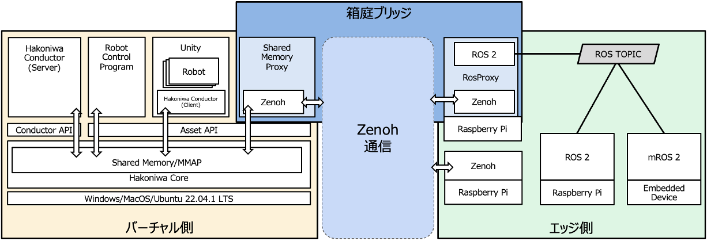

[English](README.md) ｜ 日本語

# hakoniwa-bridge

本リポジトリでは、リアル（エッジ）とバーチャル（箱庭）を接続するための通信モジュールである「箱庭ブリッジ」を提供します。

箱庭ブリッジは以下の機能を提供します。

* バーチャル側のデータをエッジ側に配信できます
* エッジ側のデータをバーチャル側で購読できます

## アーキテクチャ

箱庭ブリッジの通信は、[Zenoh](https://zenoh.io/) をベースに構築されています。

箱庭ブリッジの機能は大きく分けて、以下の２機能です。

* ShmProxy
* RosProxy

ShmProxy(SharedMemoryProxy)は、バーチャル側に配置されており、箱庭PDUデータをZenoh通信データに変換し、データ転送します。

RosProxyは、エッジ側に配置されており、ROS通信データをZenoh通信データに変換して双方を接続する役割を担います。なお、エッジ側でZenohを組み込んでいる場合は、箱庭PDUデータにそのままアクセスできます。



Zenoh を採用している理由は以下の通りです。

1. 通信方式として UDP/TCP/ROS/MQTTなど、さまざまなバリエーションを選択できる
2. さまざまなプログラミング言語のサポート（C言語、Python、Rustなど）
3. 異なるネットワークを超えるこができる（5Gルータ越しのROS通信も可能）
4. 低遅延通信であり、リアルタイム性が求められる用途に適している

## 動作環境

* バーチャル側
  * Ubuntu, MacOS
* エッジ側
  * Ubuntu
    * ROSまたはZenohを組み込み可能なデバイス（RaspberryPi等）

## サンプルプログラム

サンプルプログラムは[こちら](https://github.com/toppers/hakoniwa-bridge/tree/main/examples)。

## インストール手順

箱庭ブリッジのリポジトリをクローンします。

```
git clone --recursive https://github.com/toppers/hakoniwa-bridge.git
```

以下の順番でインストールを実施します。

バーチャル側：
- [箱庭コア機能のインストール](#箱庭コア機能のインストール)
- [Zenohのインストール](#Zenohのインストール)
- [ShmProxyの作成](#ShmProxyの作成)

エッジ側側：
- [Zenohのインストール](#Zenohのインストール)
- [RosProxyの作成](#RosProxyの作成)

### 箱庭コア機能のインストール

箱庭コア機能の[インストール手順](https://github.com/toppers/hakoniwa-core-cpp-client?tab=readme-ov-file#%E3%82%A4%E3%83%B3%E3%82%B9%E3%83%88%E3%83%BC%E3%83%AB%E6%89%8B%E9%A0%86)に従って、コア機能をインストールします。

1. ディレクトリ移動

```
cd third-party/hakoniwa-core-cpp-client
```

2. Build

```
bash build.bash
```

3. Install

```
bash install.bash
```

### Zenohのインストール

箱庭ブリッジが利用する Zenoh は、 [zenoh-c](https://github.com/eclipse-zenoh/zenoh-c) です。

`バーチャル側とエッジ側、両方にインストールする必要があります。`

1. ディレクトリ移動

```
cd third-party 
```

2. Build
```
mkdir -p build && cd build 
cmake ../zenoh-c
cmake --build . --config Release
```

3. Install
```
cmake --build . --target install
```

成功すると、以下のファイルが作成されます。

```
% ls /usr/local/include
zenoh.h                 zenoh_commons.h         zenoh_concrete.h        zenoh_configure.h       zenoh_macros.h          zenoh_memory.h
```

```
% ls /usr/local/lib
libzenohc.dylib
```

#### ShmProxyの作成

```
cd hakoniwa-bridge/virtual
```

```
bash build.bash
```

成功すると、以下のファイルが作成されます。

```
% ls cmake-build/shm-proxy/shm-proxy 
cmake-build/shm-proxy/shm-proxy
```
#### RosProxyの作成

RosProxyを作成するためには、最初に、箱庭PDUデータとして利用すROSメッセージ定義ファイルを準備する必要があります。ここでは、簡単のため、以下の標準ROSメッセージを利用する前提で説明をします。

* geometry_msgs/Twist
* std_msgs/Bool

1. ディレクトリ移動

```
cd hakoniwa-bridge/third-party/hakonwia-ros2pdu
```

2. 箱庭PDUデータの作成

今回は、ROS標準のメッセージを利用するため、箱庭PDUデータは既存のものを利用できます。
もし独自のROSメッセージを利用する場合は、[こちら](https://github.com/toppers/hakoniwa-ros2pdu/tree/4c658f62b8aac986f9d6571853407d892e01b5cc?tab=readme-ov-file#%E5%89%8D%E6%BA%96%E5%82%99)の手順にしたって、作成してください。


3. コンフィグファイルの作成

本ファイルは、箱庭のUnityエディタ上で`Generate`すると自動生成されるものです。Unityを利用しない場合や、利用する場合でも全てのPDUデータをエッジ側と共有しない場合等は、手動で編集する必要があります。

コンフィグファイルのファイル配置は以下としてください。

hakoniwa-ros2pdu/config/custom.json


定義例：

https://github.com/toppers/hakoniwa-digital-twin/blob/main/digital/config/custom.json


custom.jsonの定義については、[こちら](https://github.com/toppers/hakoniwa-core-cpp-client?tab=readme-ov-file#%E7%AE%B1%E5%BA%AD%E3%82%A2%E3%82%BB%E3%83%83%E3%83%88%E3%82%B3%E3%83%B3%E3%83%95%E3%82%A3%E3%82%B0)を参照ください。


なお、method_typeには、SHMを必ず指定してください。
また、class_nameとconv_class_nameは設定不要です。


3. RosProxyの作成

以下のコマンドを実行して RosProxyのコードを生成します。

```
bash create_proxy_ros_zenoh.bash ./config/custom.json 
```

成功すると、以下のファイルが作成されます。

```
# ls workspace/src/hako_ros_proxy/src/gen/
hako_ros_proxy_com_ros2.cpp  hako_ros_proxy_com_zenoh.cpp
```

4. RosProxyのビルド

```
cd workspace
```

```
colcon build --packages-select hako_ros_proxy
```

成功すると以下のログが出力されます。

```
Starting >>> hako_ros_proxy
[Processing: hako_ros_proxy]                             
Finished <<< hako_ros_proxy [35.4s]                       

Summary: 1 package finished [36.0s]
```

## 実行手順

### ShmProxy

ShmProxyの仕様：
```
Usage: ./cmake-build/shm-proxy/shm-proxy <asset_name> <config_path> <delta_time_msec> [master]
```

ShmProxyは、箱庭コンダクタを含んでいます。もし、箱庭コンダクタを独自に起動しない場合は、`master`オプションを利用することで、箱庭コンダクタを駆動できます。

実行例：masterオプションを利用しない場合

```
 ./cmake-build/shm-proxy/shm-proxy ShmProxy ../third-party/hakoniwa-ros2pdu/config/custom.json 20
```

実行例：masterオプションを利用する場合

```
 ./cmake-build/shm-proxy/shm-proxy ShmProxy ../third-party/hakoniwa-ros2pdu/config/custom.json 20 master
```

### RosProxy


```
source install/setup.bash 
```

```
ros2 run hako_ros_proxy hako_ros_proxy_node 
```
