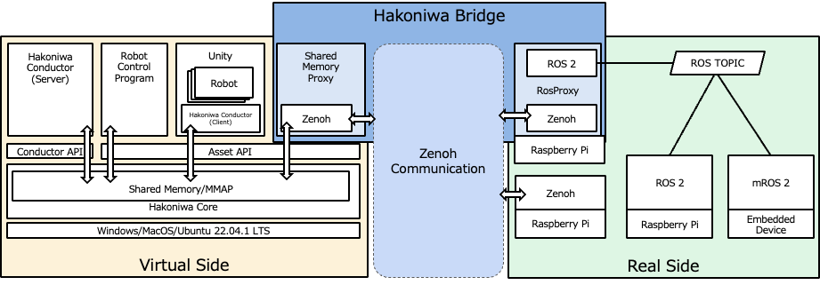

English ｜ [日本語](README-ja.md)

# hakoniwa-bridge

This repository provides "Hakoniwa Bridge," a communication module that connects the real (edge) and virtual (Hakoniwa) environments.

Hakoniwa Bridge offers the following features:

- Deliver data from the virtual side to the edge side.
- Subscribe to data from the edge side on the virtual side.

## Architecture

Communication in Hakoniwa Bridge is based on [Zenoh](https://zenoh.io/).

The functionalities of Hakoniwa Bridge are broadly divided into two:

- ShmProxy
- RosProxy

ShmProxy (SharedMemoryProxy) is located on the virtual side, converting Hakoniwa PDU data into Zenoh communication data for data transfer.

RosProxy is located on the edge side, converting ROS communication data into Zenoh communication data to connect both sides. If Zenoh is integrated on the edge side, it can directly access Hakoniwa PDU data.



The reasons for adopting Zenoh are as follows:

1. Offers a variety of communication methods such as UDP, TCP, ROS, MQTT, etc.
2. Supports multiple programming languages (C, Python, Rust, etc.)
3. Capable of bridging different networks (including ROS communication via 5G routers)
4. Provides low-latency communication suitable for real-time applications

## Environment

- Virtual side:
  - Ubuntu, MacOS
- Edge side:
  - Ubuntu
  - Devices capable of integrating ROS or Zenoh (such as Raspberry Pi)

## Sample Program

You can find the sample program [here](https://github.com/toppers/hakoniwa-bridge/tree/main/examples).

## Installation Instructions

Clone the Hakoniwa Bridge repository:

```
git clone --recursive https://github.com/toppers/hakoniwa-bridge.git
```

Follow these steps for installation:

For the virtual side:
- [Install Hakoniwa core functionalities](#installing-hakoniwa-core-functionalities)
- [Install Zenoh](#installing-zenoh)
- [Create ShmProxy](#creating-shmproxy)

For the edge side:
- [Install Zenoh](#installing-zenoh)
- [Create RosProxy](#creating-rosproxy)

### Installing Hakoniwa Core Functionalities

Follow the [installation instructions](https://github.com/toppers/hakoniwa-core-cpp-client?tab=readme-ov-file#installation-instructions) for the core functionalities.

1. Change directory

```
cd third-party/hakoniwa-core-cpp-client
```

2. Build

```
bash build.bash
```

3. Install

```
bash install.bash
```

### Installing Zenoh

The Zenoh used by Hakoniwa Bridge is [zenoh-c](https://github.com/eclipse-zenoh/zenoh-c).
Note that [Rust environment](https://www.rust-lang.org/tools/install) is required to install Zenoh.

**It needs to be installed on both the virtual and edge sides.**

1. Change directory

```
cd third-party 
```

2. Build

```
mkdir -p build && cd build 
cmake ../zenoh-c
cmake --build . --config Release
```

3. Install

You may need `sudo` when using Linux.

```
cmake --build . --target install
```

Upon success, the following files will be created:

```
% ls /usr/local/include
zenoh.h                 zenoh_commons.h         zenoh_concrete.h        zenoh_configure.h       zenoh_macros.h          zenoh_memory.h
```

```
% ls /usr/local/lib
libzenohc.dylib
```

`libzenohc.so` will be created in the Linux envrionment.

#### Creating ShmProxy

```
cd hakoniwa-bridge/virtual
```

```
bash build.bash
```

Upon success, the following file will be created:

```
% ls cmake-build/shm-proxy/shm-proxy 
cmake-build/shm-proxy/shm-proxy
```
#### Creating RosProxy

To create RosProxy, first, you need to prepare the ROS message definition files used as Hakoniwa PDU data. For simplicity, this explanation assumes the use of the following standard ROS messages:

- geometry_msgs/Twist
- std_msgs/Bool

1. Change directory

```
cd hakoniwa-bridge/third-party/hakonwia-ros2pdu
```

2. Create Hakoniwa PDU data

For this instance, we are using standard ROS messages, so you can use the existing Hakoniwa PDU data. If you are using custom ROS messages, follow the [instructions here](https://github.com/toppers/hakoniwa-ros2pdu/tree/4c658f62b8aac986f9d6571853407d892e01b5cc?tab=readme-ov-file#preparation) to create them.


3. Create a config file

This file is automatically generated when you `Generate` in Hakoniwa's Unity editor. If you do not use Unity or if you do not share
all the PDU data with the edge side even when using Unity, you need to edit the file manually.

Place the config file as follows:

hakoniwa-ros2pdu/config/custom.json


Example definition:

https://github.com/toppers/hakoniwa-digital-twin/blob/main/digital/config/custom.json


For more details on custom.json's definition, see [here](https://github.com/toppers/hakoniwa-core-cpp-client?tab=readme-ov-file#hakoniwa-asset-config).


Note, always specify SHM for method_type.
Also, class_name and conv_class_name do not need to be set.


3. Create RosProxy

Run the following command to generate the code for RosProxy:

```
bash create_proxy_ros_zenoh.bash ./config/custom.json 
```

Upon success, the following files will be created:

```
# ls workspace/src/hako_ros_proxy/src/gen/
hako_ros_proxy_com_ros2.cpp  hako_ros_proxy_com_zenoh.cpp
```

4. Build RosProxy

```
cd workspace
```

```
colcon build --packages-select hako_ros_proxy
```

Upon success, the following log will appear:

```
Starting >>> hako_ros_proxy
[Processing: hako_ros_proxy]                             
Finished <<< hako_ros_proxy [35.4s]                       

Summary: 1 package finished [36.0s]
```

## Execution Instructions

### ShmProxy

Usage of ShmProxy:

```
Usage: ./cmake-build/shm-proxy/shm-proxy <asset_name> <config_path> <delta_time_msec> [master]
```

ShmProxy includes the Hakoniwa Conductor. If you do not launch the Hakoniwa Conductor separately, you can use the `master` option to drive it.

Example of execution without the master option:

```
 ./cmake-build/shm-proxy/shm-proxy ShmProxy ../third-party/hakoniwa-ros2pdu/config/custom.json 20
```

Example of execution with the master option:

```
 ./cmake-build/shm-proxy/shm-proxy ShmProxy ../third-party/hakoniwa-ros2pdu/config/custom.json 20 master
```

### RosProxy

```
source install/setup.bash 
```

```
ros2 run hako_ros_proxy hako_ros_proxy_node 
```