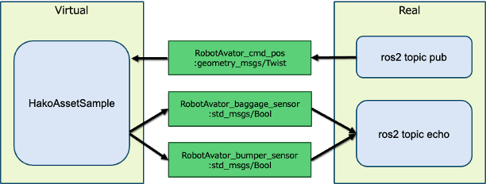

# これは何？

箱庭ブリッジの簡単なサンプルコードです。

このサンプルコードを利用すると以下を試すことができます。

* バーチャル側の箱庭アセットからPDUデータを書き込みすると、エッジ側でそのデータを参照できる
* エッジ側でPDUデータを配信すると、バーチャル側の箱庭アセットでそのデータを参照できる

# 構成

サンプルプログラムの構成は下図のとおりです。



バーチャル側の箱庭アセット HakoAssetSample は、箱庭PDUデータの読み書きを行います。

HakoAssetSample が読み込みするデータは、`RobotAvator_cmd_pos` です。

HakoAssetSample が書き込みするデータは、`RobotAvator_baggage_sensor` と `RobotAvator_bumper_sensor` です。

これらのデータは、ShmProxyを通して、エッジ側（Real）と共有されます。

リアル側では、RosProxyを通して、ROSトピックとして配信/購読できます。

HakoAssetSample が書き込みしたデータ`RobotAvator_baggage_sensor` と `RobotAvator_bumper_sensor` は、ros2 topic echo で参照できます。


HakoAssetSample が読み込みするデータである `RobotAvator_cmd_pos` は、ros2 topic echo コマンドで送信できます。


# 準備

事前に、バーチャル側とエッジ側のインストールを実施してください。

バーチャル側のサンプルプログラムをビルドします。

```
cd examples
```

```
bash build.bash
```

成功すると、以下のファイルが作成されます。
```
% ls cmake-build/sample
cmake-build/sample
```

# 実行方法

## バーチャル側

ShmProxy を起動します。

```
 ./cmake-build/shm-proxy/shm-proxy ShmProxy ../third-party/hakoniwa-ros2pdu/config/custom.json 20 master
```

サンプルプログラムを起動します。

```
./cmake-build/sample HakoSampleAsset ./custom.json 20
```

成功すると、以下のように１秒毎にログ出力されます。

```
Robot: RobotAvator, PduWriter: RobotAvator_baggage_sensor
channel_id: 1 pdu_size: 4
INFO: RobotAvator create_lchannel: logical_id=1 real_id=1 size=4
Robot: RobotAvator, PduWriter: RobotAvator_bumper_sensor
channel_id: 2 pdu_size: 4
INFO: RobotAvator create_lchannel: logical_id=2 real_id=2 size=4
INFO: asset(HakoSampleAsset) is registered.
WAIT START
WAIT RUNNING
PDU CREATED
LOADED: PDU DATA
INFO: my_on_initialize enter
INFO: sleep 1sec
INFO: my_on_initialize exit
INFO: start simulation
SYNC MODE: true
INFO: on_simulation_step enter: 20000
20000: pos data(0.000000, 0.000000, 0.000000)
INFO: on_simulation_step exit
INFO: on_simulation_step enter: 40000
40000: pos data(0.000000, 0.000000, 0.000000)
INFO: on_simulation_step exit
INFO: on_simulation_step enter: 60000
60000: pos data(0.000000, 0.000000, 0.000000)
INFO: on_simulation_step exit
```

## エッジ側

RosProxy を起動します。

```
ros2 run hako_ros_proxy hako_ros_proxy_node 
```

ROS2のトピック一覧を表示します。

```
ros2 topic list
/RobotAvator_baggage_sensor
/RobotAvator_bumper_sensor
/RobotAvator_cmd_pos
/parameter_events
/rosout
```


HakoAssetSample が書き込みしたデータ`RobotAvator_baggage_sensor` と `RobotAvator_bumper_sensor` を、ros2 topic echo で参照します。

RobotAvator_baggage_sensor:
```
ros2 topic echo /RobotAvator_baggage_sensor
```
実行結果：true/falseトグルされた表示が続きます
```
$ ros2 topic echo /RobotAvator_baggage_sensor
data: true
---
data: false
---
data: true
---
data: false
```

RobotAvator_bumper_sensor:
```
ros2 topic echo /RobotAvator_bumper_sensor:
```

実行結果：true/falseトグルされた表示が続きます
```
$ ros2 topic echo RobotAvator_bumper_sensor
data: true
---
data: false
---
data: true
---
data: false
```


HakoAssetSample が読み込みするデータである `RobotAvator_cmd_pos` を、ros2 topic echo コマンドで以下のように送信します。

```
ros2 topic pub RobotAvator_cmd_pos geometry_msgs/msg/Twist "{linear: {x: 3.5, y: 2.0, z: 1.0}, angular: {x: 0.1, y: 0.1, z: 0.2}}"
```

成功すると、バーチャル側で以下のように受信データが表示されます。

```
INFO: on_simulation_step enter: 2500000
2500000: pos data(3.500000, 2.000000, 1.000000)
INFO: on_simulation_step exit
```
